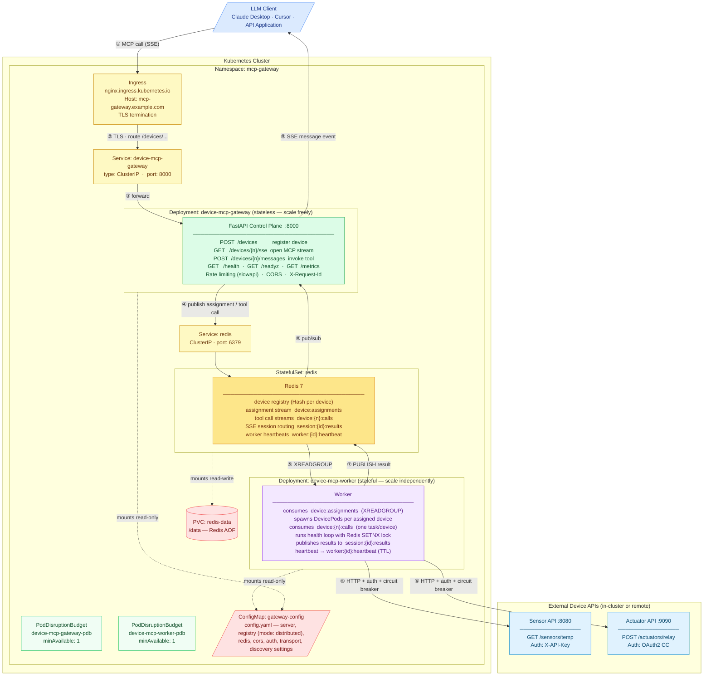
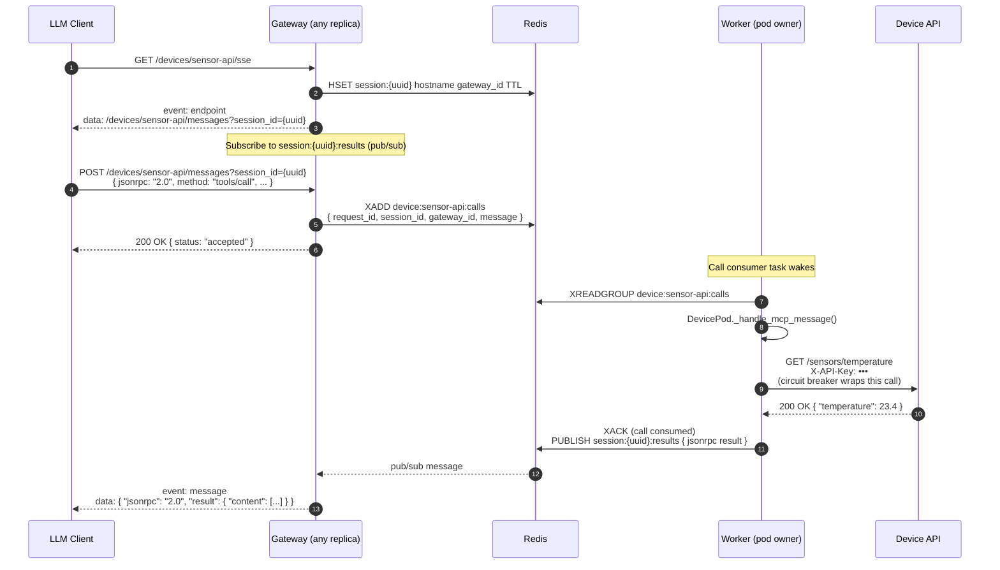

# MCP Gateway — Kubernetes Deployment Architecture

This document describes how the **Device MCP Gateway** is deployed on Kubernetes in **distributed mode** and traces the complete message path from an LLM client through the gateway to downstream device APIs.

Distributed mode is the production path: stateless gateway replicas read from Redis, while stateful workers own the DevicePods that make the actual HTTP calls to device APIs. All three tiers scale independently.

---

## Deployment Overview



> **Response path:** The worker (⑥) calls the device API, receives the JSON body, publishes it to a Redis pub/sub channel (⑦). The gateway instance that owns the SSE session subscribes to that channel (⑧) and delivers the result as an SSE `message` event (⑨) to the LLM client.

---

## Message Flow

### Device Registration


### Runtime Tool Invocation



---

## Health, Readiness, and Disruption Safety

### Gateway probes

| Probe | Path | Behaviour |
|-------|------|-----------|
| **Liveness** | `GET /health` | Returns 200 unconditionally if the process is running. K8s restarts on failure. |
| **Readiness** | `GET /readyz` | Pings Redis (`await redis.ping()`). Returns 503 if Redis is unreachable. K8s stops routing traffic until the probe passes. |

### Worker probes

Workers have no HTTP port. The liveness probe uses `exec`:

```yaml
livenessProbe:
  exec:
    command:
      - python
      - -c
      - |
        import os, sys, redis as r
        client = r.from_url(os.environ.get("MCP_REDIS_URL", "redis://redis:6379/0"))
        key = f"worker:{os.environ.get('WORKER_ID', 'unknown')}:heartbeat"
        sys.exit(0 if client.exists(key) else 1)
  initialDelaySeconds: 60
  periodSeconds: 30
  failureThreshold: 3
```

The heartbeat key is written by the worker's internal heartbeat loop with a TTL of `2 × health_check_interval`. A missing key means the loop has stalled — K8s will restart the pod after 3 consecutive failures (90 s).

### PodDisruptionBudgets

Both gateway and worker have a PDB with `minAvailable: 1`. This prevents node drains and cluster upgrades from taking down all replicas simultaneously. Rolling updates (during which one pod is replaced at a time) proceed normally as long as `replicas ≥ 2`.

> With `replicas: 1`, the PDB will **block voluntary eviction** — no pod can be drained. Operators must scale to 0 or delete the PDB before draining a node that hosts a single-replica deployment.

### Worker graceful shutdown

`terminationGracePeriodSeconds: 120`. On SIGTERM:
1. A `preStop: sleep 5` hook runs first, giving Kubernetes time to stop routing new assignments to this worker.
2. SIGTERM fires; the worker cancels its heartbeat, assignment consumer, and health loop.
3. In-flight tool calls are cancelled after the grace period expires.

> Future improvement: the shutdown handler should drain `_call_tasks` (wait for in-flight httpx calls to complete) before cancelling them, reducing the chance of mid-call interruption.

---

## Kubernetes Resource Summary

| Kind | Name | Purpose |
|------|------|---------|
| `Namespace` | `mcp-gateway` | Isolates all resources |
| `ConfigMap` | `gateway-config` | Non-secret `config.yaml` (mode: distributed, Redis URL, registry settings) |
| `Secret` | `gateway-secrets` | `api-key` and `secret-key` — injected as env vars; **never in ConfigMap** |
| `StatefulSet` | `redis` | Single Redis 7 instance with AOF persistence |
| `Service` | `redis` | ClusterIP on port 6379; accessible to gateway and worker pods |
| `PersistentVolumeClaim` | `redis-data` | Persists Redis AOF data across pod restarts |
| `Deployment` | `device-mcp-gateway` | Stateless gateway — scale freely; readiness on `/readyz` |
| `Deployment` | `device-mcp-worker` | Stateful workers — scale independently; liveness via Redis heartbeat key |
| `Service` | `device-mcp-gateway` | ClusterIP on port 8000; target of the Ingress |
| `Ingress` | `device-mcp-gateway` | External HTTPS entry; TLS termination |
| `NetworkPolicy` | `device-mcp-gateway` | Restricts ingress to port 8000 |
| `PodDisruptionBudget` | `device-mcp-gateway-pdb` | `minAvailable: 1` for gateway |
| `PodDisruptionBudget` | `device-mcp-worker-pdb` | `minAvailable: 1` for worker |
| `PersistentVolumeClaim` | `gateway-data` | **Optional.** Embedded-mode only — SQLite persistence for gateway pod. Not applied by default. |

---

## Sample Device Registrations

Register the two devices shown in the diagrams after the gateway is running. Replace `mcp-gateway.example.com` with your actual hostname.

**Sensor API** — API key authentication:
```bash
curl -X POST https://mcp-gateway.example.com/devices \
  -H "Authorization: Bearer <gateway-api-key>" \
  -H "Content-Type: application/json" \
  -d '{
    "hostname":   "sensor-api",
    "base_url":   "http://sensor-svc:8080",
    "transport":  "sse",
    "auth_type":  "api_key",
    "auth": { "api_key": "sensor-key-123", "header_name": "X-API-Key" }
  }'
```

**Actuator API** — OAuth2 client credentials:
```bash
curl -X POST https://mcp-gateway.example.com/devices \
  -H "Authorization: Bearer <gateway-api-key>" \
  -H "Content-Type: application/json" \
  -d '{
    "hostname":  "actuator-api",
    "base_url":  "http://actuator-svc:9090",
    "transport": "sse",
    "auth_type": "oauth2",
    "auth": {
      "token_endpoint": "https://auth.example.com/token",
      "client_id":      "actuator-client",
      "client_secret":  "secret",
      "scopes":         ["actuators:read", "actuators:write"]
    }
  }'
```

In distributed mode, the gateway immediately returns `{ pod_active: false }` — the pod becomes active asynchronously as a worker picks up the assignment. Poll `GET /devices/{hostname}` until `pod_active: true`.

---

## Deploying with the Provided Manifests

```bash
# 1. Customise before deploying
#    deploy/kubernetes/ingress.yaml       — replace mcp-gateway.example.com
#    deploy/kubernetes/deployment.yaml    — replace device-mcp-gateway:latest with your image
#    deploy/kubernetes/worker-deployment.yaml — adjust replicas and resources

# 2. Create namespace and secrets
kubectl create namespace mcp-gateway
kubectl create secret generic gateway-secrets \
  --namespace=mcp-gateway \
  --from-literal=api-key=$(openssl rand -hex 32) \
  --from-literal=secret-key=$(python -c "from cryptography.fernet import Fernet; print(Fernet.generate_key().decode())")

# 3. Deploy everything
kubectl apply -k deploy/kubernetes/

# 4. Watch rollouts
kubectl rollout status deployment/device-mcp-gateway -n mcp-gateway
kubectl rollout status deployment/device-mcp-worker -n mcp-gateway

# 5. Scale
kubectl scale deployment device-mcp-gateway --replicas=3 -n mcp-gateway
kubectl scale deployment device-mcp-worker --replicas=3 -n mcp-gateway
```

### Kustomize overlays (optional)

Create environment-specific overlays to patch image tags, resource limits, or replica counts without modifying the base manifests:

```
deploy/
  kubernetes/
    base/        ← move current files here when using overlays
    overlays/
      staging/
        kustomization.yaml   # patches image tag, sets lower limits
      production/
        kustomization.yaml   # patches image tag, sets production limits, HPA
```
