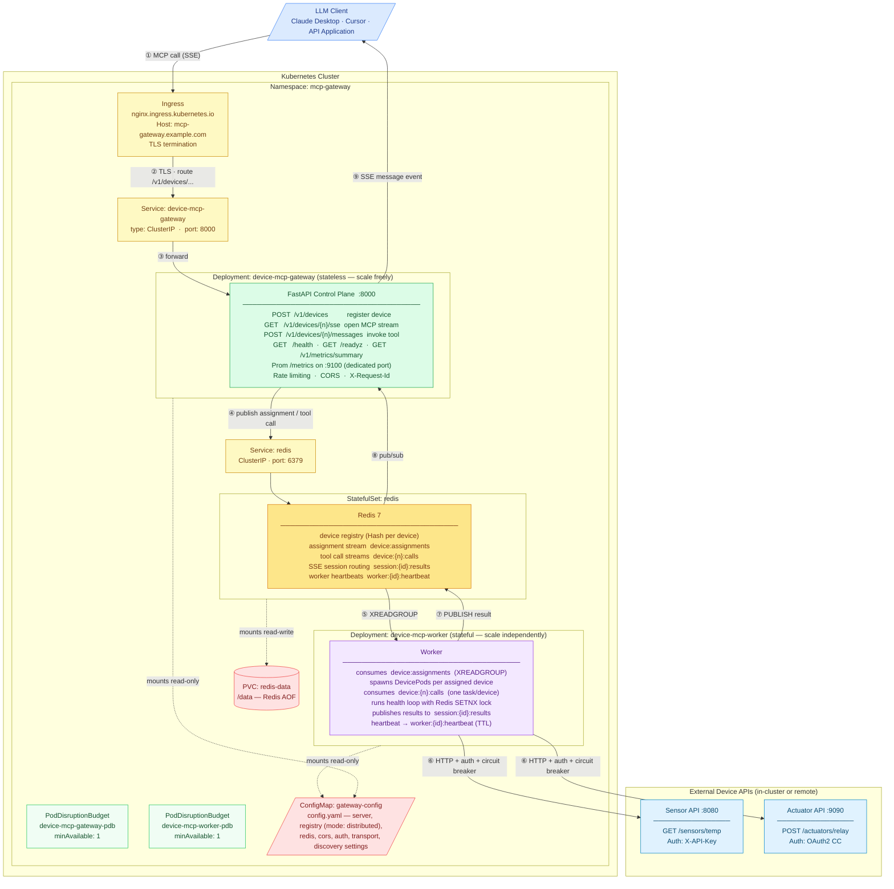
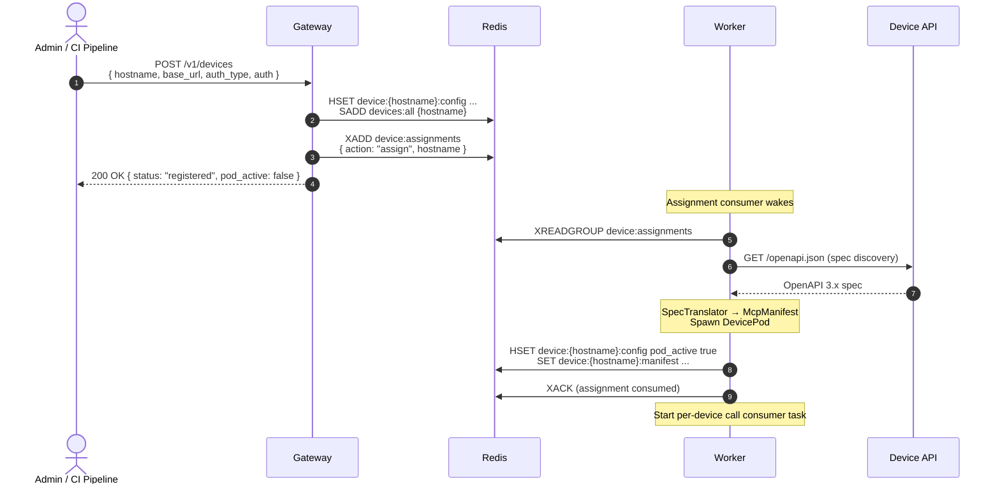
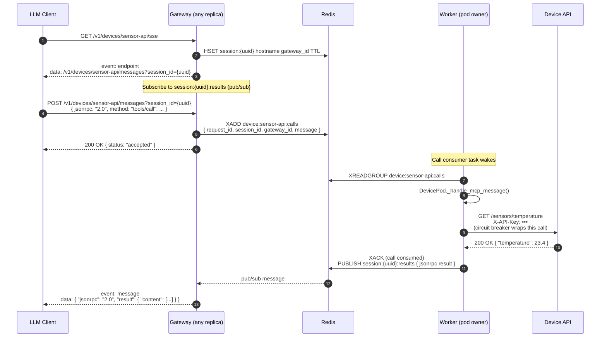

# MCP Gateway — Kubernetes Deployment Architecture

This document describes how the **Device MCP Gateway** is deployed on Kubernetes in **distributed mode** and traces the complete message path from an LLM client through the gateway to downstream device APIs.

Distributed mode is the production path: stateless gateway replicas read from Redis, while stateful workers own the DevicePods that make the actual HTTP calls to device APIs. All three tiers scale independently.

---

## Deployment Overview



> **Response path:** The worker (⑥) calls the device API, receives the JSON body, publishes it to a Redis pub/sub channel (⑦). The gateway instance that owns the SSE session subscribes to that channel (⑧) and delivers the result as an SSE `message` event (⑨) to the LLM client.

---

## Message Flow

### Device Registration



#### Registration latency — provisioning is off the request path (F-11)

`POST /v1/devices` never blocks on a slow or unreachable device. In **distributed mode** the gateway only persists the device and publishes an `assign`, returning `200 { pod_active: false }` immediately; a worker does reachability + spec discovery + translation + spawn out of band (the diagram above). In **embedded mode** the gateway runs that same provisioning on a background task and waits inline only up to `registry.registration_provision_budget` (default 8 s): a fast/healthy device finishes within the budget so the response already reflects the spawned pod, while a slow device returns promptly with `"provisioning": true` and the work continues in the background (also re-checked by the health loop). Either way the caller polls `GET /v1/devices/{hostname}` for the settled `reachable` / `pod_active` / `spawn_error`.

Spec **discovery probes candidate paths concurrently** (both the embedded registry and the worker) and takes the first path that returns a valid spec, so worst-case discovery latency is one path's timeout rather than the sum across all of `spec_paths`. Translation is bounded separately by `registry.spec_translate_timeout` (F-09).

### Runtime Tool Invocation



---

## Health, Readiness, and Disruption Safety

### Gateway probes

| Probe | Path | Behaviour |
|-------|------|-----------|
| **Liveness** | `GET /health` | Returns 200 if the process is running. In distributed mode it also reports `live_workers` and flips `status` to `"degraded"` (still 200) when no worker has a live heartbeat — a signal for the UI/operators, deliberately **not** a restart trigger (SRE #7). |
| **Readiness** | `GET /readyz` | Pings Redis (`await redis.ping()`). Returns 503 if Redis is unreachable. K8s stops routing traffic until the probe passes. **Does not** gate on worker availability — a worker outage must not pull every gateway out of the LB and break read-only endpoints. |

### Worker probes

Workers have no HTTP port. The liveness probe uses `exec`:

```yaml
livenessProbe:
  exec:
    command:
      - python
      - -c
      - |
        import os, sys, redis as r
        client = r.from_url(os.environ.get("MCP_REDIS_URL", "redis://redis:6379/0"))
        key = f"worker:{os.environ.get('WORKER_ID', 'unknown')}:heartbeat"
        sys.exit(0 if client.exists(key) else 1)
  initialDelaySeconds: 60
  periodSeconds: 30
  failureThreshold: 3
```

The heartbeat key is written by the worker's internal heartbeat loop with a TTL of `2 × health_check_interval`. A missing key means the loop has stalled — K8s will restart the pod after 3 consecutive failures (90 s).

The heartbeat is **gated on consumer-loop health** (SRE #8): the loop withholds the heartbeat (and stops refreshing device-claim leases) if a critical loop — the assignment consumer, health loop, or reconciler — has crashed, or if the assignment consumer has not made progress within `2 × health_check_interval`. So a worker whose process is alive but whose consumers are wedged now fails liveness (gets restarted) **and** lets its claims lapse so the reconciler reassigns its devices, instead of looking healthy while doing nothing.

### Rebalancing on scale-out (F-07)

Device claims are sticky — the owner refreshes its lease each heartbeat — so without rebalancing a newly added worker (e.g. from the HPA) stays idle while early workers stay hot. Each worker therefore runs a **rebalance loop** (paced by `reconcile_interval`): it computes a per-worker target = `ceil(total_devices / live_workers)` and, if it owns more than that, **sheds** the excess — releasing the claim, stopping the pod, and re-publishing an `assign`. To bias placement onto under-loaded workers, a worker **declines** an assignment while it is at/over target (the reconciler re-publishes a declined device next sweep, so it still lands), and a short `rebalance:cooldown:{hostname}` marker stops a worker from immediately re-grabbing a device it just shed. The result converges to within one device per worker, typically in a cycle or two. A shed device's pod is briefly down during the move, and any in-flight calls are reclaimed by the new owner via `XAUTOCLAIM`. Set `registry.rebalance_enabled: false` to pin devices to their first owner. The `mcp_rebalance_shed_total` counter and the per-worker `mcp_worker_pods` gauge make rebalancing activity and any residual skew visible.

### Duplicate-execution guard (F-08)

Tool calls ride a Redis Stream with **at-least-once** delivery: when a worker dies or sheds a device, the calls it had read but not acked sit in the consumer group's PEL and the new owner reclaims them via `XAUTOCLAIM`. A reclaimed call may *already have executed* on the dead worker — for a non-idempotent operation (`POST`/`PATCH`) re-running it would double-apply (e.g. a duplicate create or charge). Each worker therefore runs an **idempotency guard** keyed on the call's `request_id` before touching the upstream:

1. **Completion dedup (all methods).** If `result:{request_id}` already exists, the call finished and its result was published (the original worker just died before acking) — the reclaimed copy is dropped without re-running or re-publishing.
2. **At-most-once for non-idempotent calls.** Idempotency follows the backing HTTP method (`GET`/`HEAD`/`OPTIONS`/`TRACE`/`PUT`/`DELETE` are safe to repeat; `POST`/`PATCH` are not). Before executing a non-idempotent call the worker claims an exclusive `exec:{request_id}` marker with `SET NX`. The first executor wins; a later reclaim finds the marker set, **refuses** to re-run, and returns a `duplicate_suppressed` JSON-RPC error (code `-32002`) so the client is told definitively instead of hanging to the call timeout. Idempotent calls skip the marker and are re-run freely.

This makes a non-idempotent operation run **at most once across the fleet** even through worker death, shedding, and reclaim. It does not provide end-to-end exactly-once against the *upstream device* — that would require the device to honour an idempotency key — but it removes the gateway-introduced duplicate. The guard markers outlive the reclaim window (so a reclaim always sees them) and expire well within the per-call `request_id` lifetime (ids are unique, so a long TTL is harmless). Set `registry.idempotency_guard: false` to allow at-least-once for every method — only safe when your upstreams dedupe writes themselves. The `mcp_duplicate_calls_suppressed_total{reason}` counter exposes how often a redelivery was deduped (`already_completed`) or refused (`nonidempotent_guard`).

### Scaling a hot device — single-owner by design (F-03)

A device is owned by **exactly one worker** at a time: one lease, one consumer of its `device:{hostname}:calls` stream. Adding workers spreads *different* devices across the fleet (see rebalancing above) but does **not** split a single device's call stream across pods. A single hot device therefore scales **vertically** — its throughput is bounded by one worker's per-device concurrency cap (`registry.max_concurrent_calls_per_device`, default **20** in-flight calls) and by the upstream API itself — not horizontally.

This is a **deliberate design decision, not a gap.** Single-ownership is what makes the rest of the control plane correct and cheap:

- **At-most-once writes (F-08)** — the `exec:{request_id}` guard and `XAUTOCLAIM` reclaim assume one owner; sharding a device across pods would require cross-shard dedup.
- **Per-device ordering** — a single consumer processes a device's calls in stream order; multiple consumers would interleave.
- **One circuit breaker per device** — breaker state (open/closed, failure count) lives in the owning pod; split ownership means split-brain breaker decisions.
- **Lease failover (SRE #1/#2) and rebalancing (F-07)** — the whole device is the atomic unit that moves between workers.

Sharding one device across pods would multiply upstream connections, fracture the breaker, and complicate idempotency and ordering — substantial fragility to buy a capability that is rarely needed. For an MCP→API gateway the load is LLM-driven tool calls, and the **upstream API is almost always the first bottleneck** (most APIs rate-limit the caller, which is why the gateway honours upstream `429`/`Retry-After`, F-44). You typically hit the upstream's limit long before one worker saturates.

**If a device does run hot, scale it without sharding:**

1. **Raise the cap** — increase `registry.max_concurrent_calls_per_device` so the owning worker runs more calls in parallel.
2. **Bigger pod** — give the worker that holds the hot device more CPU/memory.
3. **Operator-level fan-out** — register the same upstream as two logical devices (e.g. `api-a` / `api-b`) so they land on different workers and the client/model spreads load across them. This shards at the *registration* boundary without touching the single-owner invariant.

**Future consideration — fairness / rate limiting (F-16, not implemented):** the concurrency cap is global to the device, so one noisy principal can monopolize a device's slots, and there is no per-principal quota or token-bucket. If multi-tenant fairness or abuse control becomes a requirement, add per-principal rate limiting as a dedicated feature — it is orthogonal to the single-owner decision above.

### PodDisruptionBudgets

Both gateway and worker have a PDB with `minAvailable: 1`. This prevents node drains and cluster upgrades from taking down all replicas simultaneously. Rolling updates (during which one pod is replaced at a time) proceed normally as long as `replicas ≥ 2`.

> With `replicas: 1`, the PDB will **block voluntary eviction** — no pod can be drained. Operators must scale to 0 or delete the PDB before draining a node that hosts a single-replica deployment.

### Worker graceful shutdown

`terminationGracePeriodSeconds: 120`. On SIGTERM:
1. A `preStop: sleep 5` hook runs first, giving Kubernetes time to stop routing new assignments to this worker.
2. SIGTERM fires; the worker stops accepting new work — it cancels the background loops (heartbeat, assignment consumer, health, reconciler) and the per-device call consumers, so no new tool calls are dispatched.
3. **In-flight tool calls are drained** (SRE #6): the worker waits up to `registry.shutdown_drain_timeout` (default 25 s) for active calls to finish before cancelling any stragglers, then tears down pods and deregisters from `workers:active`.

> Keep `terminationGracePeriodSeconds` comfortably above `shutdown_drain_timeout` (120 s vs 25 s here) so the drain completes before Kubernetes force-kills the pod.

---

## Redis availability & durability

In distributed mode Redis is the **single source of truth and a single point of failure** (SRE #9). It carries *all* shared state on the hot path:

- the device registry (`device:{h}:config`, `devices:all`),
- the assignment, per-device call, and **per-session result streams**,
- the shared rate limiter, device **claim leases**, and the **reconciler leader lock**.

**Failure behaviour.** If Redis is unreachable, gateways fail `GET /readyz` (Redis `PING`) and are pulled from the load balancer; workers retry their stream reads until it returns. No split-brain occurs because claims and the reconciler lock are Redis keys — when Redis is down, nothing is assigned or reassigned. Recovery is automatic once Redis is back.

**Durability.** The provided `redis.yaml` runs `--appendonly yes`, so the AOF persists the registry and every stream across a restart. Because tool-call results are now **Redis Streams** rather than fire-and-forget pub/sub (SRE #3), a clean restart **no longer loses in-flight results** — a reconnecting gateway re-reads the session's result stream from where it left off. Only writes within the last `appendfsync` window (default `everysec` → ≤ 1 s) can be lost on an unclean crash.

**Production recommendation.** The single-node StatefulSet is fine for dev and small deployments but has no failover. For production, run **Redis Sentinel** (HA with automatic failover) or **Redis Cluster**, and point `MCP_REDIS_URL` at the Sentinel/Cluster endpoint. Size the command and pub/sub connection pools (`redis.max_connections`, `redis.pubsub_max_connections`) for your gateway/worker replica count and expected concurrent SSE streams.

---

## Observability

Each gateway and worker pod exposes Prometheus metrics on a dedicated port (`:9100`, separate from the `:8000` API). The UI/BFF and operators should treat **Prometheus and the read APIs as the observability surface — not pod log files** (see "UI/BFF sourcing" below).

### Failure-mode metrics (SRE O1)

Sites that previously only logged a failure now also increment a counter, so request loss/shedding is visible in metrics:

| Metric | Type | Incremented when |
|--------|------|------------------|
| `mcp_tool_call_timeouts_total{hostname}` | counter | the gateway's F6 watcher fires — no worker set `result:{id}` before the deadline |
| `mcp_sse_messages_dropped_total{hostname}` | counter | an embedded-mode SSE client queue is full and a response is dropped |
| `mcp_dead_letter_total{hostname}` | counter | an undeliverable tool call is moved to `device:{h}:calls:dead` |
| `mcp_circuit_breaker_opens_total{hostname}` | counter | a device pod's circuit breaker rejects a call |

### Worker backlog & HPA signal (SRE #5)

`mcp_worker_pending_calls` counts **delivered-but-unacked** (in-flight) work, but the per-device concurrency cap (SRE #5) holds excess work **undelivered** in the stream, where XPENDING can't see it. `mcp_worker_undelivered_calls` exposes that never-read backlog (XINFO GROUPS lag). **Sum the two for total work waiting → the recommended worker HPA signal.**

### Fleet gauges are leader-gated (SRE O4)

`mcp_registered_devices`, `mcp_active_pods`, and `mcp_reachable_devices` are fleet-wide. To avoid every gateway replica running a full `list_devices()` each cycle (×replicas Redis load), only the replica holding the `gateway:gauge-leader` lock computes them. **Consequence:** these gauges are populated on one replica at a time — aggregate them with `max()` across replicas in Prometheus. (Embedded mode is a single process and always refreshes.) The `/v1/admin/overview` read aggregate is likewise served from a short-TTL per-replica cache with an `ETag` (`gateway.read_cache_ttl`, default 5 s) so a polling UI doesn't trigger a fresh `list_devices()` per request.

### End-to-end tracing (SRE O2)

The gateway assigns each request an `X-Request-Id` (generated if absent) and logs it as `rid`. That `rid` is now propagated as a field on the tool-call stream and bound into the **worker's** audit log lines, so a single id traces a call across the gateway→worker hop. Filter logs in both pods by `rid=<value>` to follow one invocation end to end.

### Per-call latency: Prometheus, not logs (SRE O3)

In distributed mode tool calls execute on the worker, so the **gateway's** audit log carries no `duration_ms` for them — that field is emitted by the gateway only in embedded mode. The worker does log `duration_ms`, but in a separate pod a gateway sidecar cannot read. The mode-independent source of per-call latency is the worker's Prometheus histogram **`mcp_tool_call_duration_seconds{hostname}`**. **Contract for the UI/BFF:** source distributed-mode latency from Prometheus (e.g. `histogram_quantile` over `mcp_tool_call_duration_seconds_bucket`), not from gateway logs.

### UI/BFF log sourcing (SRE O5)

If the UI runs as a gateway-pod sidecar, do **not** make it depend on tailing `logs/gateway.log`: that file rotates (50 MB × 5) and, more importantly, **worker logs — tool execution, latency, dead-letters — live in a different pod the sidecar cannot see**. The supported sourcing model is:

- **Metrics** (RED, failure-mode counters, latency histogram) from each pod's `:9100` Prometheus endpoint, aggregated by a Prometheus server;
- **Fleet/device state** from the gateway read APIs (`GET /v1/admin/overview`, `GET /v1/metrics/summary`, `GET /v1/devices`);
- **Structured logs**, if needed, shipped from *all* pods (gateway and worker) to a central log store and queried by `rid` — never read from one pod's local file.

---

## Kubernetes Resource Summary

| Kind | Name | Purpose |
|------|------|---------|
| `Namespace` | `mcp-gateway` | Isolates all resources |
| `ConfigMap` | `gateway-config` | Non-secret `config.yaml` (mode: distributed, Redis URL, registry settings) |
| `Secret` | `gateway-secrets` | `api-key`, `secret-key`, `redis-password`, `redis-url` — injected as env vars; **never in ConfigMap**. Distributed mode requires the api-key (F-23) and an authenticated `redis-url` (F-24). |
| `StatefulSet` | `redis` | Single Redis 7 instance with AOF persistence |
| `Service` | `redis` | ClusterIP on port 6379; accessible to gateway and worker pods |
| `PersistentVolumeClaim` | `redis-data` | Persists Redis AOF data across pod restarts |
| `Deployment` | `device-mcp-gateway` | Stateless gateway — scale freely; readiness on `/readyz` |
| `Deployment` | `device-mcp-worker` | Stateful workers — scale independently; liveness via Redis heartbeat key |
| `Service` | `device-mcp-gateway` | ClusterIP on port 8000; target of the Ingress |
| `Ingress` | `device-mcp-gateway` | External HTTPS entry; TLS termination |
| `NetworkPolicy` | `device-mcp-gateway` | Restricts ingress to port 8000 |
| `PodDisruptionBudget` | `device-mcp-gateway-pdb` | `minAvailable: 1` for gateway |
| `PodDisruptionBudget` | `device-mcp-worker-pdb` | `minAvailable: 1` for worker |
| `PersistentVolumeClaim` | `gateway-data` | **Optional.** Embedded-mode only — SQLite persistence for gateway pod. Not applied by default. |

---

## Sample Device Registrations

Register the two devices shown in the diagrams after the gateway is running. Replace `mcp-gateway.example.com` with your actual hostname.

**Sensor API** — API key authentication:
```bash
curl -X POST https://mcp-gateway.example.com/v1/devices \
  -H "Authorization: Bearer <gateway-api-key>" \
  -H "Content-Type: application/json" \
  -d '{
    "hostname":   "sensor-api",
    "base_url":   "http://sensor-svc:8080",
    "transport":  "sse",
    "auth_type":  "api_key",
    "auth": { "api_key": "sensor-key-123", "header_name": "X-API-Key" }
  }'
```

**Actuator API** — OAuth2 client credentials:
```bash
curl -X POST https://mcp-gateway.example.com/v1/devices \
  -H "Authorization: Bearer <gateway-api-key>" \
  -H "Content-Type: application/json" \
  -d '{
    "hostname":  "actuator-api",
    "base_url":  "http://actuator-svc:9090",
    "transport": "sse",
    "auth_type": "oauth2",
    "auth": {
      "token_endpoint": "https://auth.example.com/token",
      "client_id":      "actuator-client",
      "client_secret":  "secret",
      "scopes":         ["actuators:read", "actuators:write"]
    }
  }'
```

In distributed mode, the gateway immediately returns `{ pod_active: false }` — the pod becomes active asynchronously as a worker picks up the assignment. Poll `GET /v1/devices/{hostname}` until `pod_active: true`.

---

## Deploying with the Provided Manifests

**Cluster prerequisites:** an ingress controller (the manifests use ingress-nginx),
metrics-server (the CPU HPAs need it), and a default StorageClass (Redis PVC). The
Prometheus Operator is optional and **not** required by the default apply — `prometheus-rules.yaml`
and `servicemonitor.yaml` are excluded from `kustomization.yaml` so a cluster without the
CRDs still applies cleanly. See the README's "Cluster prerequisites" table.

```bash
# 1. Build and push the image (there is no published image), then set it in BOTH
#    deployment.yaml and worker-deployment.yaml (they share one image).
docker build -t <your-registry>/device-mcp-gateway:0.1.2 .
docker push <your-registry>/device-mcp-gateway:0.1.2
sed -i 's#image: device-mcp-gateway:latest#image: <your-registry>/device-mcp-gateway:0.1.2#' \
  deploy/kubernetes/deployment.yaml deploy/kubernetes/worker-deployment.yaml
#    (kind/minikube: skip the push and `kind load docker-image device-mcp-gateway:0.1.2`)
#    Also customise:
#    deploy/kubernetes/ingress.yaml       — replace mcp-gateway.example.com
#    deploy/kubernetes/worker-deployment.yaml — adjust replicas and resources

# 2. Create namespace and secrets
#    Distributed mode REQUIRES an API key (else the gateway refuses to start — Tier-0 F-23)
#    and an authenticated Redis (redis-password + a redis-url that carries it — Tier-0 F-24).
kubectl create namespace mcp-gateway
REDIS_PW=$(openssl rand -hex 24)
kubectl create secret generic gateway-secrets \
  --namespace=mcp-gateway \
  --from-literal=api-key=$(openssl rand -hex 32) \
  --from-literal=secret-key=$(python -c "from cryptography.fernet import Fernet; print(Fernet.generate_key().decode())") \
  --from-literal=redis-password="$REDIS_PW" \
  --from-literal=redis-url="redis://:$REDIS_PW@redis:6379/0"   # use rediss:// when Redis terminates TLS
#    The Ingress also needs a TLS secret (mcp-gateway-tls) — issue it via cert-manager
#    or create one manually (`kubectl create secret tls mcp-gateway-tls ...`).

# 3. Deploy everything
kubectl apply -k deploy/kubernetes/

# 4. Watch rollouts
kubectl rollout status deployment/device-mcp-gateway -n mcp-gateway
kubectl rollout status deployment/device-mcp-worker -n mcp-gateway

# 5. Scale
kubectl scale deployment device-mcp-gateway --replicas=3 -n mcp-gateway
kubectl scale deployment device-mcp-worker --replicas=3 -n mcp-gateway
```

### Kustomize overlays (optional)

Create environment-specific overlays to patch image tags, resource limits, or replica counts without modifying the base manifests:

```
deploy/
  kubernetes/
    base/        ← move current files here when using overlays
    overlays/
      staging/
        kustomization.yaml   # patches image tag, sets lower limits
      production/
        kustomization.yaml   # patches image tag, sets production limits, HPA
```
