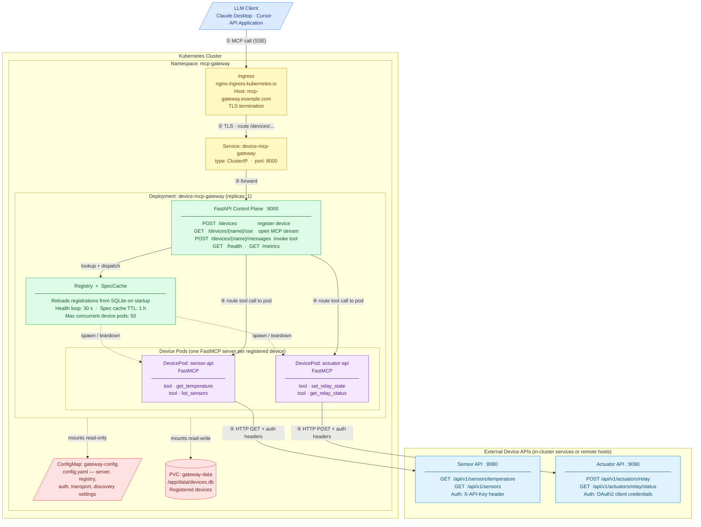
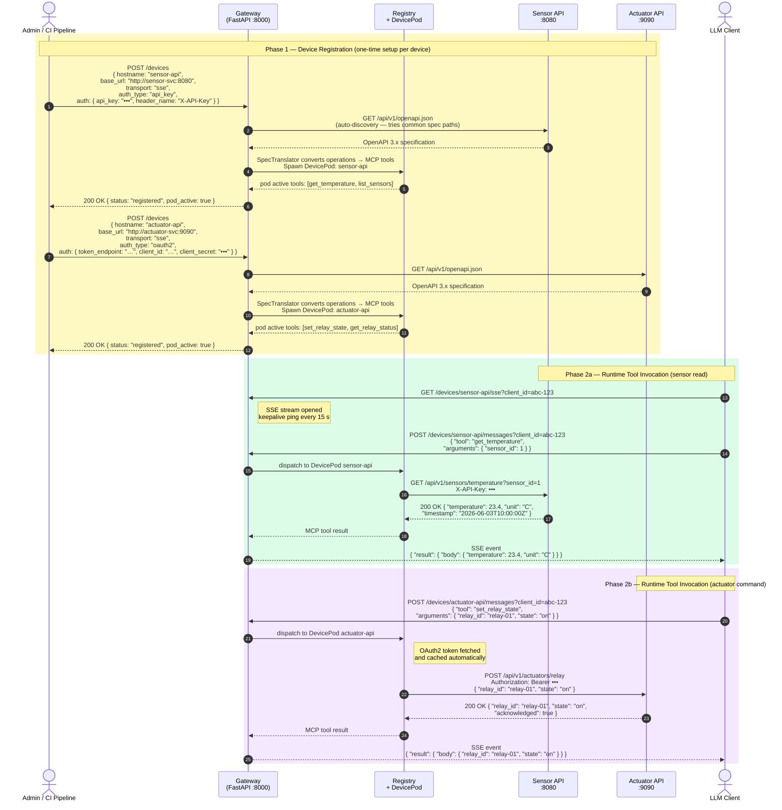

# MCP Gateway — Kubernetes Deployment Architecture

This document describes how the **hermeshome Device MCP Gateway** is deployed on Kubernetes and traces the complete message path from an LLM client through the gateway to downstream device APIs.

The two sample devices used throughout — a **Sensor API** and an **Actuator API** — represent the most common patterns: a read-only telemetry endpoint and a command/control endpoint.

---

## Deployment Overview

The diagram below shows every Kubernetes object, the internal application components running inside the gateway pod, and the two external device APIs. Numbered arrows trace the forward request path; responses follow the same path in reverse.



> **Response path:** ⑥ JSON body returns from the device API → ⑦ DevicePod wraps it as an MCP tool result → ⑧ Gateway delivers it to the LLM client as an SSE event over the open stream established in step ①.

---

## Message Flow

The sequence diagram below covers two phases:

- **Device Registration** — a one-time admin operation that teaches the gateway about each API.
- **Runtime Tool Invocation** — the repeated LLM-driven call cycle at inference time.



---

## Kubernetes Resource Summary

| Kind | Name | Purpose |
|------|------|---------|
| `Deployment` | `device-mcp-gateway` | Gateway container (`python:3.12-slim`); single replica (see note below) |
| `Service` | `device-mcp-gateway` | ClusterIP on port 8000; target of the Ingress rule |
| `Ingress` | `device-mcp-gateway` | External HTTPS entry point; TLS termination; routes all `/devices/…` traffic |
| `ConfigMap` | `gateway-config` | Supplies `config.yaml` at `/app/config.yaml` inside the container |
| `PersistentVolumeClaim` | `gateway-data` | Persists `devices.db` at `/app/data`; device registrations survive pod restarts |

> **Single-replica constraint:** Device pods are in-process — they run as async tasks inside the gateway process. Horizontal scaling requires an external registry backend (not yet implemented). Run one replica and rely on the PVC and SQLite persistence for durability across pod restarts.

---

## Sample Device Registrations

Register the two devices shown in the diagrams after the gateway is running.

**Sensor API** — API key authentication:

```bash
curl -X POST https://mcp-gateway.example.com/devices \
  -H "Content-Type: application/json" \
  -d '{
    "hostname":   "sensor-api",
    "base_url":   "http://sensor-svc:8080",
    "transport":  "sse",
    "auth_type":  "api_key",
    "auth": {
      "api_key":     "sensor-key-123",
      "header_name": "X-API-Key"
    }
  }'
```

**Actuator API** — OAuth2 client credentials:

```bash
curl -X POST https://mcp-gateway.example.com/devices \
  -H "Content-Type: application/json" \
  -d '{
    "hostname":  "actuator-api",
    "base_url":  "http://actuator-svc:9090",
    "transport": "sse",
    "auth_type": "oauth2",
    "auth": {
      "token_endpoint": "https://auth.example.com/token",
      "client_id":      "actuator-client",
      "client_secret":  "••••",
      "scopes":         ["actuators:read", "actuators:write"]
    }
  }'
```

Once registered, point your MCP client at the SSE stream:

```
GET https://mcp-gateway.example.com/devices/sensor-api/sse
GET https://mcp-gateway.example.com/devices/actuator-api/sse
```

Both devices will be automatically reconnected if the gateway pod is restarted, as long as the `gateway-data` PVC is intact.

---

## Deploying with the Provided Manifests

All Kubernetes resources are in [`deploy/kubernetes/`](../deploy/kubernetes/). The directory is structured as a [Kustomize](https://kustomize.io/) base so you can overlay environment-specific values without editing the base files.

### Files

| File | Purpose |
|------|---------|
| `namespace.yaml` | Creates the `mcp-gateway` namespace |
| `configmap.yaml` | Supplies `config.yaml` to the container (non-secret settings only) |
| `pvc.yaml` | 10 Gi `ReadWriteOnce` volume for `devices.db` |
| `deployment.yaml` | Single-replica gateway pod; liveness + readiness on `/health` |
| `service.yaml` | ClusterIP on port 8000 |
| `ingress.yaml` | NGINX ingress with TLS stub (update host and secretName) |
| `kustomization.yaml` | Kustomize root — applies all of the above |

### Quick Start

```bash
# 1. Edit deploy/kubernetes/ingress.yaml — replace mcp-gateway.example.com with your domain
# 2. Edit deploy/kubernetes/deployment.yaml — replace device-mcp-gateway:latest with your image

# 3. Create the namespace and secrets
kubectl apply -f deploy/kubernetes/namespace.yaml
kubectl create secret generic gateway-secrets \
  --namespace=mcp-gateway \
  --from-literal=api-key=$(openssl rand -hex 32) \
  --from-literal=secret-key=$(python -c "from cryptography.fernet import Fernet; print(Fernet.generate_key().decode())")

# 4. Deploy everything
kubectl apply -k deploy/kubernetes/

# 5. Watch rollout
kubectl rollout status deployment/device-mcp-gateway -n mcp-gateway
```

### Overlays (optional)

Create environment-specific overlays under `deploy/kubernetes/overlays/<env>/` to patch the image tag, resource limits, or replica count without modifying the base:

```
deploy/
  kubernetes/
    base/        ← rename current files here when using overlays
    overlays/
      staging/
        kustomization.yaml   # patches image tag, sets lower limits
      production/
        kustomization.yaml   # patches image tag, sets production limits
```
